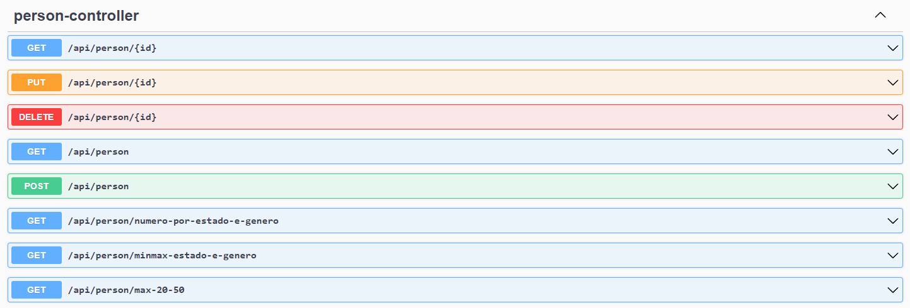

# Teste para Desenvolvedor Java na CTMGEO

## Descrição

Este é um teste para a empresa CTMGEO para a contratação de desenvolvedores Java. O objetivo do teste é criar uma API que retorne os seguintes dados:

- Obter os estados com maior número de pessoas de cada sexo e os estados com menor número de pessoas de cada sexo;
- Obter os estados com maior número de pessoas acima dos 50 anos e os estados com maior número de pessoas abaixo dos 20 anos;
- Obter uma relação de estados e a quantidade de pessoas de cada sexo.

## Instalação

Este projeto utiliza o Maven como gerenciador de dependências e o Spring Boot como framework. Para instalar e executar o projeto, siga os passos abaixo:

1. Certifique-se de ter o Java e o Maven instalados em sua máquina.
2. Clone o repositório para a sua máquina local.
3. Navegue até a pasta do projeto via terminal.
4. Execute o comando `mvn clean install` para instalar as dependências do projeto.
5. Execute o comando `mvn spring-boot:run` para iniciar a aplicação.

## Uso

Após a instalação, a API estará disponível para uso. É possível testar as funcionalidades da API através de qualquer cliente HTTP, como o Postman.

As rotas da API são:


Elas estão melhor documentadas na rota /swagger-ui/index.html.

## Testes

Os testes de integração são uma parte importante deste projeto. Para executá-los, siga os passos abaixo:

1. Certifique-se de que todas as dependências estão instaladas e o projeto foi compilado corretamente com `mvn clean install`.
2. Os testes utilizam o banco de dados e a porta 8080, então é importante que o projeto não esteja rodando durante eles.
3. Para rodar os testes, utilize o comando:
   ```sh
   mvn test
   ```
4. Verifique os resultados dos testes no terminal para garantir que tudo está funcionando como esperado.

Os testes ajudam a garantir que as funcionalidades da API estão corretas e que futuras alterações não introduzam bugs.